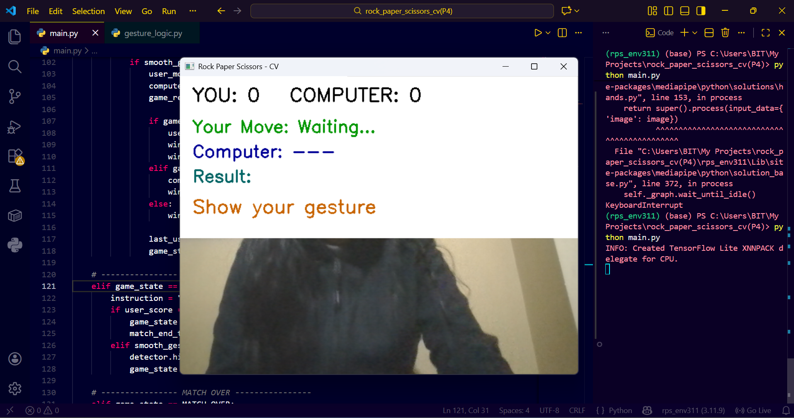

# ✋✊✌️ Hand Gesture Rock Paper Scissors Game

A real-time **Rock Paper Scissors** game controlled using **hand gestures**, built with **Python**, **OpenCV**, and **MediaPipe**.

## 📸 Demo


---

## 🚀 Features
- Real-time hand gesture detection using webcam
- Recognizes Rock, Paper, and Scissors gestures
- Computer generates random moves
- Displays win / lose / draw result
- Clean and modular Python code

---

## 🛠️ Technologies Used
- Python
- OpenCV
- MediaPipe
- NumPy

---

## 🧠 How It Works
- Webcam captures live video
- MediaPipe detects hand landmarks
- Finger positions are analyzed
- Gesture is classified as Rock, Paper, or Scissors
- Game logic determines the result

---

## 🧠 Technical Overview
- Used **MediaPipe Hands** to detect 21 hand landmarks
- Classified gestures by analyzing finger open/close states
- Implemented game logic to determine win, lose, or draw
- Designed modular Python code for readability and maintainability

---

## 📂 Project Structure
```
hand-gesture-rock-paper-scissors/
├── main.py
├── gesture_logic.py
├── rock.png
├── paper.png
├── scissors.png
├── README.md
```

---

## ▶️ How to Run
```bash
pip install opencv-python mediapipe numpy
python main.py
```

---

🎯 Learning Outcomes

- Computer Vision fundamentals
- Real-time video processing
- Gesture classification logic
- Python project structuring

## 👩‍💻 Author
**Shreeja**
